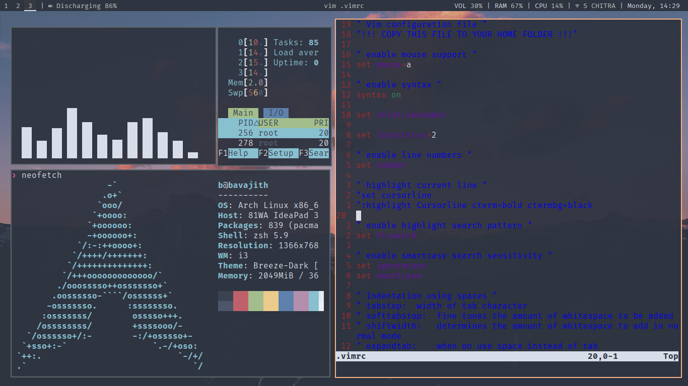
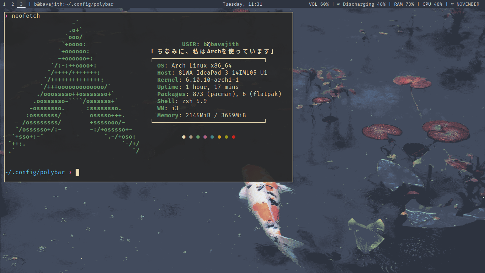

# My Dotfiles Repository

Welcome to my dotfiles repository! This repository contains the configuration files for various applications and tools that I use to customize my Linux environment, primarily on Arch Linux with the i3 window manager.

## Applications Included

- **Alacritty**: A fast, GPU-accelerated terminal emulator with my personalized settings for colors and fonts.
  ```bash
  sudo pacman -S alacritty
- **i3**: Configuration for the i3 window manager, featuring custom keybindings, window management settings, and themes for a minimalist desktop experience.
  ```bash
  sudo pacman -S i3
- **Rofi**: A powerful application launcher and window switcher, configured to enhance productivity and workflow.
  ```bash
  sudo pacman -S rofi
- **Ranger**: A terminal file manager with custom color schemes and file previews, designed for efficient file navigation.
  ```bash
  sudo pacman -S ranger
- **Neofetch**: A command-line tool that displays system information alongside an ASCII logo of your OS, customized to reflect my setup.
  ```bash
  sudo pacman -S neofetch
- **Neovim**: An extensible text editor with a personalized configuration that includes useful plugins and settings for enhanced coding efficiency.
  ```bash
  sudo pacman -S neovim
- **Polybar**: A fast and modular status bar for i3, set up to display essential information and notifications.
  ```bash
  sudo pacman -S polybar
## Features

- **Minimalist Design**: Each configuration is tailored for simplicity and efficiency, ensuring a clean and organized workspace.
- **Custom Keybindings**: Enhanced navigation and management through custom shortcuts in i3 and Rofi.
- **Aesthetic Consistency**: A cohesive color palette across applications for a pleasant visual experience.

## My Setup

### i3 Window Manager



## Installation

To use my dotfiles, you can clone this repository and symlink the configuration files to your home directory:

```bash
git clone https://github.com/bavajitu/i3wm-config.git ~/.config
